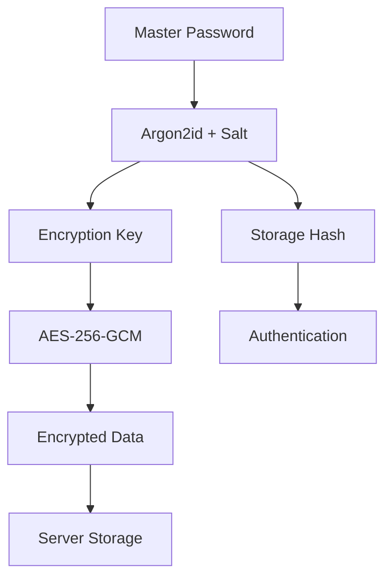
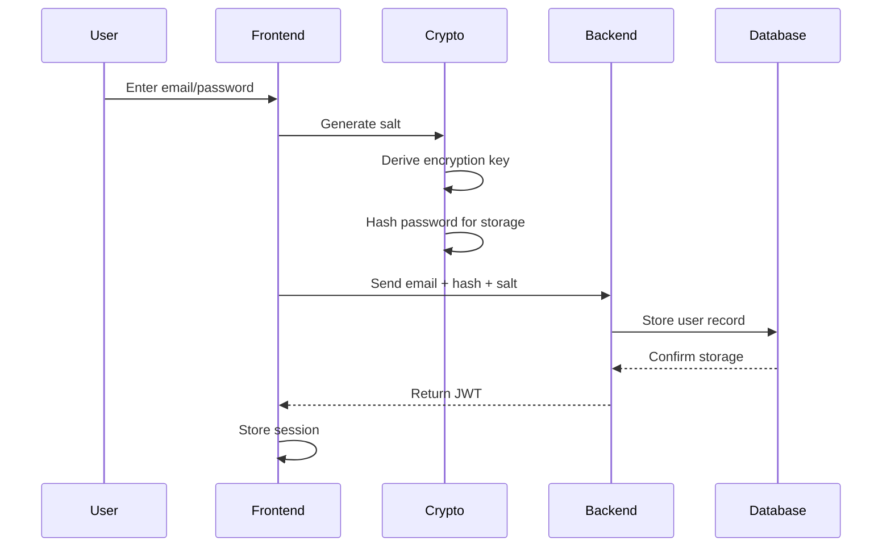
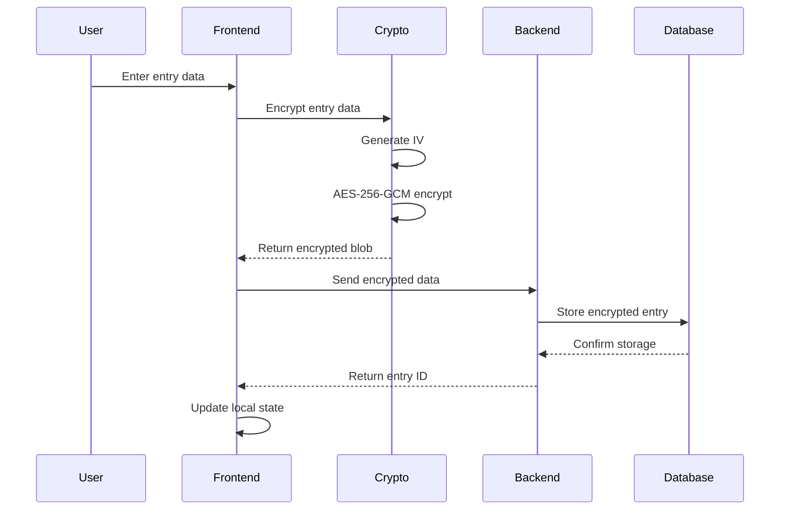

# SecureVault Architecture Documentation

## System Overview

SecureVault is a zero-knowledge password management application designed with security-first principles. The application ensures that sensitive data is encrypted client-side before transmission and storage.

## Security Architecture

### Cryptographic Design



### Key Derivation Process

1. **User Registration**:
   ```typescript
   salt = generateRandomBytes(32)
   encryptionKey = Argon2id(password, salt, params)
   storageHash = Argon2id(password, salt, params) // Different from encryption key
   ```

2. **Data Encryption**:
   ```typescript
   iv = generateRandomBytes(12)
   encrypted = AES-256-GCM(plaintext, encryptionKey, iv)
   stored = { iv, ciphertext, authTag }
   ```

3. **Authentication**:
   ```typescript
   provided = Argon2id(inputPassword, storedSalt, params)
   valid = constantTimeCompare(provided, storedHash)
   ```

## Component Architecture

### Frontend Components

```
src/
├── components/
│   ├── AuthForm.tsx          # Sign up/in forms
│   ├── UnlockForm.tsx        # Vault unlock interface
│   ├── VaultDashboard.tsx    # Main vault interface
│   ├── VaultEntry.tsx        # Individual entry display/edit
│   ├── AddEntryDialog.tsx    # New entry creation
│   ├── PasswordGenerator.tsx # Secure password generation
│   └── PasswordStrengthMeter.tsx # Password analysis
├── contexts/
│   └── VaultContext.tsx      # Global state management
├── lib/
│   ├── crypto.ts            # Cryptographic utilities
│   └── storage.ts           # Secure local storage
└── pages/
    └── VaultApp.tsx         # Main application router
```

### State Management

The application uses React Context for state management with the following structure:

```typescript
interface VaultContextType {
  // Authentication state
  isAuthenticated: boolean
  isUnlocked: boolean
  user: User | null
  
  // Vault state
  entries: VaultEntry[]
  isLoading: boolean
  
  // Actions
  signUp: (email: string, password: string) => Promise<void>
  signIn: (email: string, password: string) => Promise<void>
  unlockVault: (password: string) => Promise<void>
  
  // Entry management
  addEntry: (entry: VaultEntry) => Promise<void>
  updateEntry: (id: string, entry: Partial<VaultEntry>) => Promise<void>
  deleteEntry: (id: string) => Promise<void>
}
```

## Data Flow

### Authentication Flow



### Entry Creation Flow



## Security Measures

### Client-Side Security

1. **Memory Management**:
   - Clear sensitive data from memory after use
   - Use secure random number generation
   - Implement automatic session timeouts

2. **Input Validation**:
   - Sanitize all user inputs
   - Validate data before encryption
   - Prevent XSS and injection attacks

3. **Crypto Implementation**:
   - Use Web Crypto API when available
   - Implement constant-time comparisons
   - Use authenticated encryption (AES-GCM)

### Server-Side Security (Planned)

1. **API Security**:
   - JWT token authentication
   - Rate limiting on all endpoints
   - Request validation and sanitization

2. **Database Security**:
   - Encrypted connections (TLS)
   - Parameterized queries to prevent SQL injection
   - Regular security updates

3. **Infrastructure Security**:
   - HTTPS enforcement with HSTS
   - Content Security Policy headers
   - Secure cookie configuration

## Performance Considerations

### Frontend Optimization

1. **Crypto Operations**:
   - Use Web Workers for heavy Argon2id operations
   - Cache derived keys during session
   - Lazy load cryptographic libraries

2. **UI Performance**:
   - Virtual scrolling for large entry lists
   - Debounced search queries
   - Optimized re-renders with React.memo

3. **Bundle Optimization**:
   - Code splitting by route
   - Tree shaking for unused code
   - Compressed crypto libraries

### Backend Optimization (Planned)

1. **Database Performance**:
   - Indexed queries on user_id and created_at
   - Connection pooling
   - Query optimization

2. **Caching Strategy**:
   - Redis for session storage
   - Rate limiting cache
   - API response caching where appropriate

## Deployment Architecture

### Production Environment

```
┌─────────────────┐    ┌─────────────────┐    ┌─────────────────┐
│   Load Balancer │    │   Web Servers   │    │   Database      │
│                 │    │                 │    │                 │
│ • SSL/TLS       │◄──►│ • Node.js API   │◄──►│ • PostgreSQL    │
│ • Rate Limiting │    │ • Static Assets │    │ • Replication   │
│ • DDoS Protection    │ • Health Checks │    │ • Backup        │
└─────────────────┘    └─────────────────┘    └─────────────────┘
```

### Development Environment

```bash
# Frontend Development
npm run dev              # Vite dev server on :5173
npm run build           # Production build
npm run preview         # Preview production build

# Backend Development (Planned)
npm run dev:api         # Express dev server on :3001
npm run build:api       # Build production API
npm run migrate         # Run database migrations

# Full Stack Development
docker-compose up       # Start all services
npm run dev:full        # Start frontend + backend
```

## Testing Strategy

### Unit Tests
- Cryptographic function tests
- Component rendering tests
- State management tests
- Utility function tests

### Integration Tests
- Authentication flow tests
- Entry CRUD operation tests
- Encryption/decryption workflow tests
- API endpoint tests

### Security Tests
- Cryptographic strength validation
- Input sanitization tests
- Session security tests
- Vulnerability scanning

## Monitoring & Logging

### Application Metrics
- Authentication success/failure rates
- Entry creation/modification frequency
- Performance metrics (encryption time)
- Error rates and types

### Security Monitoring
- Failed authentication attempts
- Suspicious activity patterns
- Crypto operation failures
- Session timeout events

### Infrastructure Monitoring
- Server resource usage
- Database performance
- Network latency
- SSL certificate expiration

## Disaster Recovery

### Backup Strategy
1. **Database Backups**:
   - Automated daily encrypted backups
   - Point-in-time recovery capability
   - Cross-region backup replication

2. **User Data Export**:
   - Encrypted JSON export functionality
   - User-controlled backup generation
   - Import validation and recovery

3. **Application Recovery**:
   - Infrastructure as Code (IaC)
   - Automated deployment pipelines
   - Health checks and failover

### Recovery Procedures
1. **Data Loss Scenarios**:
   - Database restoration procedures
   - User notification protocols
   - Data integrity verification

2. **Security Incidents**:
   - Incident response procedures
   - User communication plans
   - Security audit requirements

## Future Enhancements

### Planned Features
1. **Multi-Factor Authentication**:
   - TOTP support
   - Hardware key integration
   - Biometric authentication

2. **Advanced Security**:
   - Device trust management
   - Geo-location restrictions
   - Advanced threat detection

3. **User Experience**:
   - Browser extension
   - Mobile applications
   - Improved sharing capabilities

### Scalability Improvements
1. **Performance**:
   - Database sharding
   - CDN integration
   - Advanced caching

2. **Security**:
   - Hardware Security Module (HSM)
   - Zero-knowledge proofs
   - Quantum-resistant cryptography

This architecture provides a solid foundation for a secure, scalable password management system while maintaining the zero-knowledge security model.
